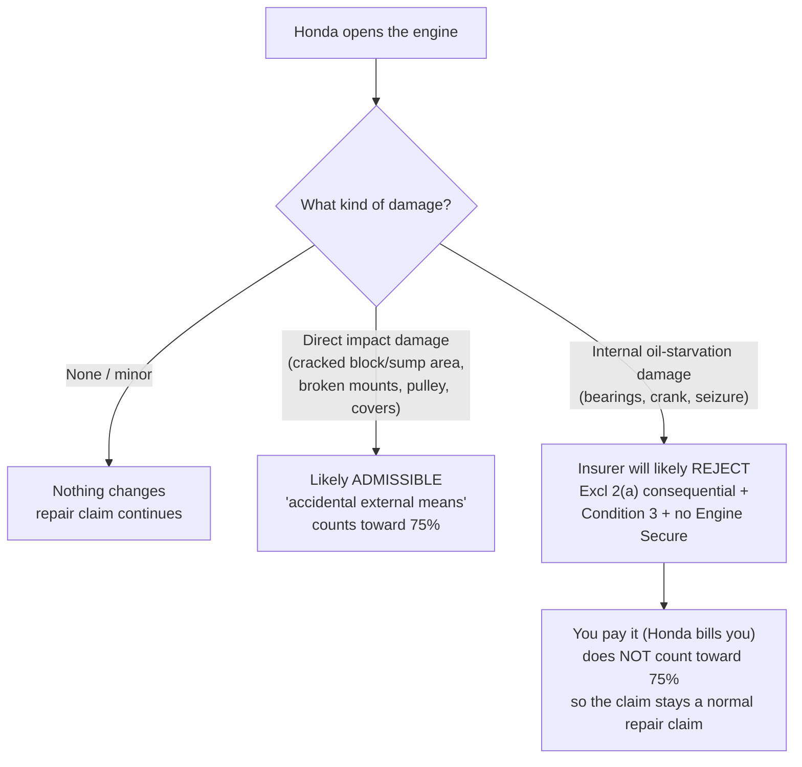
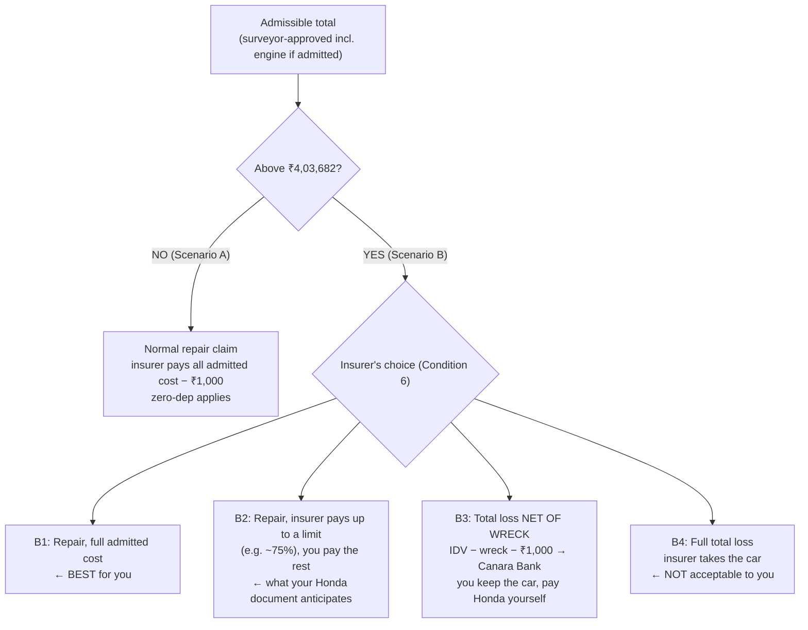

# CODE RED — Engine damage, the 75% line, and keeping the car

Vehicle MH27DE4665 · Policy 6206007703 00 00 · IDV **₹5,38,242** · 75% of IDV = **₹4,03,682**
Goal: **repair the car, keep it, get the maximum from Tata AIG.**
Everything below comes from your policy wording (V02, UIN IRDAN108RPMT0002V02200001), Tata AIG's Customer Information Sheet (CIS), your schedule, or IRDAI rules. Where something is a judgement call or unknown, it says so.

---

## 0. The 6 facts that decide everything

| # | Fact | Source |
|---|---|---|
| 1 | The 75% line is measured on the **"aggregate cost of retrieval and/or repair… subject to terms and conditions of the policy"**. That means the **insurer-admissible** cost, **not** Honda's total bill. Denied or excluded items don't count toward ₹4.04L | Policy, Definitions §3 (CTL) |
| 2 | **Repair (partial loss):** the insurer pays the *"actual and reasonable costs of repair… subject to depreciation"*. **No 75% cap is written there.** The only ceiling is the IDV | Condition 6(b) |
| 3 | **The insurer chooses** repair or cash *"at its own option"*. You can ask for repair, but you **can't force it** | Condition 6 |
| 4 | **Total loss payout** = **IDV − value of the wreck**. That payment goes to **Canara Bank first**, because of your loan | Condition 6(a); IMT 7 |
| 5 | **Engine damage from running after oil loss** is the insurer's strongest exclusion. Tata AIG sells **Engine Secure** for exactly this, and you **didn't** buy it | Excl. 2(a); Condition 3; CIS (Engine Secure); schedule |
| 6 | Your signed Honda document is a contract **between you and Honda**. It **does not change** what Tata AIG owes you under the policy | Contract basics; the policy defines the insurer's liability |

---

## 1. FIRST QUESTION: is the engine damage covered at all?

This decides whether the engine cost even counts toward ₹4.04L.

**Why the insurer will resist oil-starvation damage (the hard facts):**
- **Excl. 2(a):** no payment for *"consequential loss… mechanical or electrical breakdown, failures or breakages."*
- **Condition 3:** *"if the vehicle insured be **driven** before the necessary repairs are effected, any extension of the damage… shall be entirely at the insured's own risk."*
- **CIS, Engine Secure:** Tata AIG's add-on that covers *"leakage of lubricating oil… [with] visible evidence of accidental damage to engine or respective assembly."* So the insurer treats oil-leak engine damage as an **add-on risk**, and that add-on is "NA" on your schedule.

**Your honest arguments (genuinely arguable, not guaranteed):**
1. **The cause was the accident.** The oil pan was broken in the crash, and the surveyor has already **approved the oil pan** as accident damage.
2. **Condition 3 says "driven".** The car was **started, not driven**.
3. **Exclusion clauses are read narrowly, and ambiguity favours the insured.** The burden is on the insurer to prove the exclusion applies (Supreme Court, *National Insurance v. Vedic Resorts*, 2023).
4. **Any part of the engine damage that comes directly from the impact** (not from oil starvation) is plain accident damage. Make sure it's itemised separately.

**Non-negotiable:** be truthful that it was started once. Established fraud means the policy is cancelled *ab initio* and **you lose the entire claim**, not just the engine.

**What to ask for (protects you either way):**
> "Before the engine is opened, please ask the surveyor to be **present at the engine teardown** (or to re-inspect it), so the cause of each damage is recorded jointly."

Basis: the surveyor's duty of **inspection and re-inspection** and of **taking expert opinion** (IRDAI Surveyor Regs 2015, Reg. 13(1)(d), (o)). The insurer's own 7 Oct message requires **written approval before** any work found after dismantling.

---

## 2. SCENARIO MAP: admissible total vs the ₹4,03,682 line

"Admissible total" = what the surveyor approves, including any approved engine work.

### Scenario A: admissible total stays at or below ₹4,03,682 (most likely if the engine is excluded or minor)
- **The insurer pays:** all admitted items, at full cost (zero-dep), minus the ₹1,000 deductible. Cashless to Honda.
- **You pay:** consumables (≈ ₹8,748 as assessed), plus any item the insurer didn't approve that Honda still does. **If engine damage is excluded, the whole engine bill is yours.**
- **Your Honda document should NOT be triggered**, because the 75% line isn't crossed. **Check its wording** (Section 3).
- **Your job here:** maximise approvals (`surveyor-talking-points.md`) and get **written approval before** any engine work.

### Scenario B: admissible total goes above ₹4,03,682
This can only happen if **significant engine damage is admitted** (or large re-approvals). Your order of asks:

| Option | Insurer pays | You pay | Who gets the money | Keeps car? | Policy basis |
|---|---|---|---|---|---|
| **B1: repair, full** | **All admitted cost** − ₹1,000 | Consumables + non-admitted items | Honda (cashless) | ✅ | Condition 6(b): actual cost, cap = IDV |
| **B2: repair, capped by agreement** | The agreed figure (e.g. ~₹4.04L) | Bill − insurer's figure (your Honda doc: up to ₹1.5L) | Honda (cashless) | ✅ | Negotiated, under Condition 6 "at its own option" |
| **B3: total loss net of wreck** | ₹5,38,242 − **W** − ₹1,000 | **The whole Honda bill** − that payout | **Canara Bank** (IMT 7) | ✅ | Condition 6(a) |
| **B4: full total loss** | ₹5,38,242 − ₹1,000 | — | Canara Bank | ❌ | Condition 6(a) |

**W = wreck (salvage) value.** The insurer sets it, usually through salvage bids. **I don't know W.** Ask for it in writing if total loss comes up.

**Compare B2 and B3 with real numbers. Don't assume:**
- Under **B2**, your cost = **Honda bill − insurer's agreed figure**.
- Under **B3**, your cost = **Honda bill − (₹5,37,242 − W)**.
- **B3 is better than B2 only if W < (₹5,37,242 − insurer's B2 figure).** Example: if the B2 figure is ₹4,03,682, B3 wins only if the wreck value is below about ₹1.34L.
- **Cash-flow warning for B3:** the payout goes to **Canara Bank** to reduce your loan. **You** have to pay Honda's full bill from your own pocket up front. B1 and B2 are cashless, so Honda gets paid by the insurer directly.

**Why B1 is your opening position:** Condition 6(b) contains no 75% cap. The 75% clause only lets the insurer *treat* the car as a total loss; it doesn't oblige it to. Asking for full repair-basis settlement is legitimate.

**Zero-dep note:** zero-dep (TA01) applies to **repair** settlements (B1/B2). In a total loss (B3/B4), payment is IDV-based, and zero-dep plays no role.

---

## 3. Your signed Honda document: what it does and doesn't do

**What it does:** it's your promise **to Honda** to pay the shortfall above 75% of IDV, up to ₹1.5L, so the repair goes ahead even in Scenario B2.

**What it does NOT do:**
- It **doesn't reduce Tata AIG's liability.** The insurer owes what the policy says (Condition 6(b) for a repair).
- It **isn't an offer to Tata AIG.**
- It **doesn't oblige you to pay ₹1.5L automatically.** It should only cover an **actual shortfall**, if one exists.

**Your talking position with Tata AIG is the policy (B1).** The Honda document is your **backup arrangement with Honda**, not your opening offer to the insurer. You don't need to volunteer it in the negotiation. **If you are asked about it, answer truthfully.**

**Get a copy of the signed document NOW and check these 6 things:**

| Check | Why |
|---|---|
| 1. **Which "cost" is the 75% measured on?** Honda's total bill, or the insurer-assessed amount? | The policy measures on the admissible amount. If the document uses Honda's gross bill, it could trigger while the insurer still sees a normal repair claim |
| 2. Is it **"the shortfall, up to ₹1.5L"** or a **fixed ₹1.5L**? | It should be the shortfall only. Every rupee the insurer later approves must reduce what you owe Honda |
| 3. Does it cover **denied items** too, or **only** the amount above 75%? | Denied items are separate. Make sure they're not counted twice |
| 4. What happens if the insurer declares a **full total loss (B4)**? | You'd lose the car. Ask what Honda would charge (dismantling, storage, work already done) |
| 5. Does it **waive** anything, or say "full and final"? | It must not limit your rights against Tata AIG |
| 6. Date, RO number, signatures, and a copy in your hands | Evidence |

**Ceiling note:** if the insurer pays up to ₹4,03,682 and you cover up to ₹1.5L, the document funds a Honda bill of at most about **₹5.54L**. A bill larger than that is outside the document, so renegotiate before any such work.

---

## 4. What to say to Tata AIG (scripts)

**Before the engine is opened:**
> "Honda will now open the engine. The oil pan, which you've approved as accident damage, broke in the crash, and the oil was lost because of that. The engine was started once afterwards; it was not driven. Please arrange for the surveyor to attend the teardown or re-inspect, so the cause of each damage is recorded jointly. The workshop will seek written approval before any engine work, as your message requires."

**If engine damage is denied:**
> "Please give the denial in writing, with the specific clause and reasons, and itemise any impact damage separately from the rest. The oil loss was caused by the accident, as your approval of the oil pan shows. Condition 3 refers to the vehicle being *driven*, and it was not driven. Exclusions are for the insurer to prove and must be read narrowly."
*(IRDAI 2024: deductions must be "transparent, reasonable and supported by documentary justification". Reg. 13(1)(n): the surveyor must give reasons.)*

**If the total crosses ₹4,03,682:**
> "I want the vehicle **repaired**, not written off. For a repair, your liability under Condition 6(b) is the actual and reasonable cost of repair, up to the IDV. The 75% clause allows total-loss treatment; it doesn't cap repair payments. Please settle on a **repair basis for the full admitted amount**."

**If the insurer refuses full repair basis:**
> "Then please give me in writing: (1) the maximum you'll pay on a **repair basis**, and (2) the **total-loss net-of-wreck** figure with the **salvage value** you're using. I'll choose after comparing them."

**Never say:** "I'll pay everything above ₹4 lakh." **Never agree verbally.** End every call with: *"Please send that in writing."*

---

## 5. Rules in your favour (quick list)

| Rule | Source |
|---|---|
| Repair liability = actual reasonable cost, up to the IDV. No 75% cap | Policy Condition 6(b) |
| Total-loss payout = IDV − wreck. You can keep the wreck (net of wreck) | Condition 6(a) |
| No salvage deduction on a repair claim | Condition 6(c); IRDAI MC 2024 |
| Exclusions are for the insurer to prove; ambiguity favours you; the insurer needs "cogent reasons" to depart from a survey | Supreme Court, *Vedic Resorts* (2023) |
| The authorised dealer's assessment takes precedence where it conflicts with the surveyor's | NCDRC, *Royal Sundaram v. Ishwar Singh Mehra* (2024) |
| Copy of the survey report to you; surveyor must re-inspect, take expert opinion, give reasons | IRDAI Surveyor Regs 2015, Reg. 13 |
| Report within **15 days** of allotment (₹500/day to you if late); decision within **7 days**; **interest at bank rate + 2%** if delayed | IRDAI Master Circular 2024 |
| Insurer can't reject over a breached condition that isn't relevant to the loss | IRDAI Master Circular 2024 |
| Complaint reply in 14 days → Bima Bharosa → **Ombudsman (free, up to ₹50L, award binding, ₹5,000/day penalty if unpaid after 30 days)** | IRDAI Master Circular 2024 |
| Sign any discharge note **"under protest"** if anything is still disputed | Supreme Court, *Boghara Polyfab* (2009); Delhi HC (2026) |

---

## 6. Action list, in order

1. [ ] **Get a copy of the signed Honda document.** Check the 6 points in Section 3.
2. [ ] **Ask Honda why the document was needed.** Has engine or other damage already been found that pushes the total toward ₹4L? Ask for the latest estimate in writing.
3. [ ] **Engine:** ask for the surveyor's presence or re-inspection at teardown. Honda itemises **impact damage separately** from oil-starvation damage, with photos.
4. [ ] **Written approval** for any engine work **before** it's done (the insurer's 7 Oct condition).
5. [ ] If the admissible total nears ₹4.04L: ask for **B1** in writing. If refused, get the **B2 figure and the B3 figure (with salvage value)** in writing, then compare.
6. [ ] If B3 is chosen: confirm **Canara Bank's** consent and arrange cash to pay Honda (the insurer's money goes to the bank).
7. [ ] At delivery: no depreciation line, no salvage deduction, ₹1,000 deductible only. Your Honda payment = **actual shortfall only**. Sign "under protest" if anything is disputed.

---

### Sources
- Policy wording V02 (Section I, Excl. 2(a), Conditions 2, 3, 6(a)(b)(c), CTL definition): [Tata AIG base wording](https://www.tataaig.com/s3/Auto_Secure_Private_Car_Package_Base_Policy_Wording_31ed1ddc55.pdf)
- Engine Secure condition (oil leakage) and claim process: [Tata AIG Customer Information Sheet](https://www.tataaig.com/s3/auto_secure_private_car_package_policy_cis_5af461c4e5.pdf)
- IMT 7 hypothecation (payment to the pledgee for loss not made good by repair): Tata AIG Auto Secure wording, IMT endorsements section
- [IRDAI Master Circular on Policyholders' Interests 2024](https://www.caalley.com/irdai_mc/MC_Protection_of_Policyholders_interests_2024.pdf) · [IRDAI PPHI 2024 deductions summary](https://www.angelone.in/news/personal-finance/irdai-strengthens-safeguards-for-motor-insurance-policyholders-interests-what-you-need-to-know)
- [IRDAI Surveyor Regs 2015, Reg. 13](https://www.godigit.com/content/dam/godigit/general/documents/duties-and-responsibilities-of-surveyor-and-loss-assessor.pdf)
- [Supreme Court, Vedic Resorts (2023)](https://www.livelaw.in/amp/top-stories/insurance-company-must-give-cogent-reasons-for-not-accepting-surveyors-report-supreme-court-229018) · [NCDRC, Royal Sundaram (2024)](https://www.livelaw.in/amp/consumer-cases/ncdrc-assessment-dealer-surveyor-report-insured-amount-259082)
- [Delhi HC 2026, discharge voucher](https://www.scconline.com/blog/post/2026/03/22/del-hc-execution-of-discharge-voucher-acknowledging-settlement-bars-further-claims/) · [Boghara Polyfab (SC 2009)](https://www.caseon.in/case/national-insurance-co-ltd-vs-ms-boghara-polyfab-pvt-ltd)
