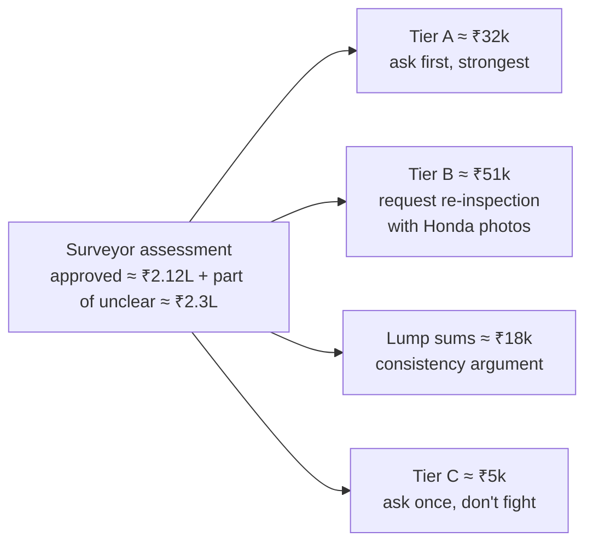
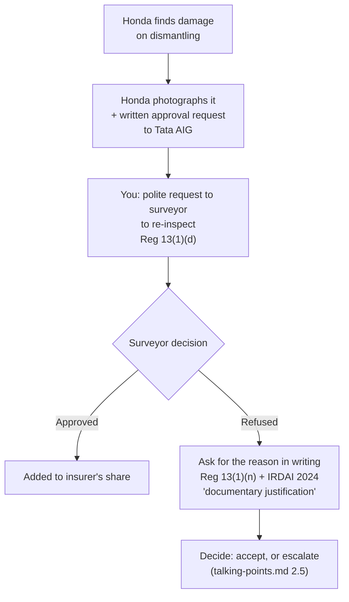

# Talking Points for the Tata AIG Surveyor (only)

**Vehicle** MH27DE4665 · **Policy** 6206007703 00 00 · **RO** SER-RO-DD178-2627-2300 · **Assessment received** 7 Oct 2026

**Approach:** Honda's estimate is treated as accurate, and we don't argue with Honda. We question the surveyor **only where the assessment looks inconsistent or mistaken, and where there's money to recover.** Everything here is tied to a policy clause, an IRDAI rule, a court ruling, or the accident photos.
**Tone:** polite, specific, in writing. *"Please reconsider"*, not *"you are wrong"*.

---

## 0. The money map: what's realistically recoverable

| Tier | What | ₹ at stake (incl. GST) | Strength |
|---|---|---:|---|
| **A** | Inconsistencies, policy-mandated amounts, Honda part facts | **≈ 32,200** | Strong |
| **B** | Re-inspection requests (Honda finds damage, surveyor re-checks) | **≈ 51,400** | Medium, needs Honda's photos |
| **L** | Lump-sum labour: a "can't deny both" consistency argument | up to **≈ 18,100** | Medium |
| **C** | Polite single asks (fluids lost in the crash) | **≈ 5,100** | Low |
| — | Don't push (would hurt credibility) | ≈ 7,700 | — |

> I don't know exactly which of the "unclear" items are already inside the ₹2.3 lakh. So **step 1 is always: get the line-by-line amounts** (Section 1).

---

## 1. First, ask for these (your legal rights)

> "Sir, before we discuss individual items, could you please share **a copy of the survey report / assessment with the allowed amount per line and the reason for each deduction**?"

| Right | Source |
|---|---|
| The surveyor must send **a copy of the report to the insured**, with comments on whether the insured agrees with the assessment | **IRDAI (Insurance Surveyors & Loss Assessors) Regulations 2015, Reg. 13(2)** |
| Surveyor duties include **re-inspection** (d), **answering the insured's queries** (l), **taking expert opinion** (o), giving **reasons for repudiation** (n), staying **neutral** "without jeopardising… claim of the insured" (c) | Same regulations, Reg. 13(1) |
| Claim deductions must be **"reasonable, transparent and supported by documentary justification"** | IRDAI (Protection of Policyholders' Interests…) Regulations 2024 |
| The surveyor's report is **not final**. The insurer needs **"cogent and satisfactory reasons"** to deviate. **Ambiguous policy wording is read in favour of the insured** | Supreme Court, *National Insurance v. Vedic Resorts & Hotels* (17 May 2023) |
| **Where the authorised dealer's assessment and the surveyor's differ, the dealer's assessment takes precedence**, because the dealer inspects more thoroughly | NCDRC, *Royal Sundaram v. Ishwar Singh Mehra* (RP 1150/2017, reported 28 May 2024) |

👉 The last row is why "Honda says it's damaged" carries weight. Use it calmly: *"Honda, the authorised dealer, has found this damaged on dismantling. Could you re-inspect it?"*

---

## 2. Confirm these in writing (zero-dep needs no question; it is already applied)

| # | Ask | Why | ₹ protected |
|---|---|---|---:|
| 1 | *(No question needed.)* **Zero-dep is already being applied.** The ₹2.3L matches the approved lines | Just check that the final settlement has **no depreciation deduction** | — |
| 2 | "Is the **only** deduction from the approved amount the **₹1,000 compulsory deductible**?" | Schedule: voluntary deductible ₹0, imposed excess ₹0 | — |
| 3 | "Is there **no salvage deduction**?" | Policy Condition 6(c): *"The Company shall not deduct any amount in lieu of salvage value."* IRDAI MC 2024 says the same | Varies |
| 4 | "Is **GST included** in the payable amount?" | You have no GSTIN (schedule: "NA"), so GST is a real cost to you | ≈ 18% of everything |
| 5 | "Is any **paint-material depreciation** being deducted?" | Section I rule 5 deducts 50% of the material share (25%) of paint. Ask them to waive it under zero-dep. Grey area | ≈ 2,335 |

---

## 3. TIER A: strong asks (≈ ₹32,200)

### A1. Labour denied, but the part it fits is APPROVED (≈ ₹5,740)
The surveyor approved these parts but crossed out (or put "?" against) the labour to fit them. A part can't be fitted without labour.

| Approved part | Labour line denied / "?" | ₹ (incl. GST) |
|---|---|---:|
| SRS reel assy (clock spring) ✓ | Replace reel, SRS cable (?) | 679.68 |
| Both front crash sensors ✓ | Replace both front crash sensors (?) | 339.84 |
| — (harness disturbed) | R/RFT wiring harness (?): **the harness is visibly hanging loose in the accident photo IMG_4963** | 2,124.00 |
| R & L splash guards ✓, R & L inner fenders ✓ | 4 replace-labour lines (✗) | 927.48 |
| Alloy wheel 15×5½J ✓ | Replace right front disc wheel (✗) | 509.76 |
| Torque rod (MT) ✓ | Replace rod, torque, lower (✗) | 309.16 |
| Torque-rod bracket (MT high road) ✓ | Engine-side mounting labour line (✗). Honda's labour code text says "DIESEL", but the bracket it fits is approved | 850.19 |

> "These parts are approved in your assessment, so the labour to fit them is necessary. If you consider this labour already included in another approved line, please tell me **which line**, so the workshop doesn't bill it to me."

### A2. Tyre: at least 50% is payable under the policy (₹3,245)
- **Policy Section I, Exclusion 2(b):** *"Damage to tyres and tubes unless the vehicle is damaged at the same time, in which case the liability of the Company shall be limited to 50% of the cost of replacement."*
- The vehicle **was** damaged at the same time (the whole claim), and Honda has found the tyre damaged. So 50% of ₹6,490 = **₹3,245 is contractually payable**. A flat ✗ on the tyre contradicts the policy.
- Don't argue for 100%. Tata AIG's own website says tyres aren't covered under nil-dep "unless specified in the policy". 50% is the solid claim.

> "As per Section I Exclusion 2(b), 50% of the tyre is payable when the vehicle is damaged in the same accident. Please allow ₹3,245."

### A3. Compressor clutch set: may be a separate, necessary part (₹13,886)
- The approved compressor is Honda part **38810**-55C-K01. The denied clutch set is a **separate Honda part number**, 38900-55A-004.
- On Honda's parts listings, **some 38810 compressors are supplied bare, with "clutch and coil sold separately"** (e.g. 38810-5R7-A02, 38810-RX0-A01), while others include the clutch. It depends on the model.
- **What to get from Honda (a document, not an argument):** a screenshot of the **Honda parts catalogue (EPC) page for the Amaze compressor** showing whether 38810-55C-K01 includes the clutch.

> "Honda's catalogue shows the Amaze compressor 38810-55C-K01 is supplied **without** the clutch, which is a separate part (38900-55A-004). Without it the new compressor can't work. Please approve the clutch set." *(Use this only if the EPC confirms it. If the compressor includes the clutch, drop this point.)*

### A4. Steering gearbox (rack): marked unclear (₹9,306)
- The **right front wheel was pushed back** (IMG_4960/4961). The surveyor **approved** the tie-rod end, right lower arm, stabiliser link, right drive shaft and the **subframe the rack is mounted on**. The steering linkage was clearly in the impact path.
- It's safety-critical. Honda has assessed the rack as damaged.

> "The rack is mounted on the subframe you've approved, and the tie-rod end attached to it is approved too. Honda found the rack damaged on dismantling. Please approve it, or re-inspect."

---

## 4. TIER B: request RE-INSPECTION with Honda's evidence (≈ ₹51,400)

**How to ask:** *"Honda has found these damaged after dismantling. Under your duty to re-inspect (Reg. 13(1)(d)), could you please re-inspect, or accept Honda's photos? The written-approval request is coming from the workshop."*
(This matches the insurer's own message: *"take written approval for the parts denied in assessment or need to be required after dismantling"*.)

| Item | ₹ | Supporting fact for the surveyor |
|---|---:|---|
| **Right headlamp** | **19,064** | The **right front corner took the main impact** (IMG_4960/4961/4962). A broken white plastic mounting bracket is visible **directly below the right headlamp** at the bumper/fender junction (IMG_4961). A lamp that can't be mounted securely can't be aimed correctly. Zero-dep covers plastic parts. *Ask Honda for close-up photos of the lamp's broken mounting points.* |
| **Left drive shaft, left damper, left lower arm** | **13,341** | The **left front corner also hit the kerb**: the left frame member/crash extension is **bent and exposed**, the left headlamp's lower bracket is broken, the wiring harness is hanging (IMG_4963). If these are approved, also ask to restore the **suspension labour cut (₹3,600 → ₹2,200, ≈ ₹1,652)**. |
| **Repair RH front frame** (circled) | 4,956 | Structural damage on the right front, the main impact corner. The surveyor approved the bulkhead and subframe, which are adjacent structures. |
| **Base front grille** (unclear) | 4,141 | The bumper was **torn completely off** (IMG_4960/4962). Honda found the grille base broken. |
| **Left fog lamp** | 3,229 | The **right** fog lamp is approved. The **left bumper corner was torn away** (IMG_4963), and the fog lamp sits in that corner. |
| **Repair I-beam** (bumper reinforcement) | 2,596 | The beam was **fully exposed and took the kerb impact** (IMG_4962). |
| **ACG (alternator) belt** | 1,506 | It's a **part, not a consumable**. TA18's consumables list (oils, nuts, bolts, clips, filters, AC gas…) doesn't include belts. The AC compressor and radiator in the same belt area were destroyed and approved. |
| **Refinish right A-pillar** (circled) | 1,314 | The right fender was **pushed back into the A-pillar area** (IMG_4961 shows the displaced fender at the pillar). |
| **Repair LHS fender** | 1,003 | Left front corner impact (IMG_4963). If it's approved, **its paint also needs approval**: the paint line was approved for "RH" only. |
| Spacers R/L front bumper side (unclear) | 207 | Bumper torn off. Small, so include it in the same request. |

---

## 5. Lump-sum labour: the "can't deny both" point (up to ≈ ₹18,100)
Three lines are circled or queried: **"Accidental removal & refitment" ₹5,310**, **"Accidental repair" ₹7,670**, and **the bulkhead/wheel-house/lower-member/gusset labour ₹5,101**.

The surveyor has **also** crossed out several **individual** removal/fitting lines (Section 3, A1).

> "If the individual fitting labour is disallowed because it's covered by the removal & refitment lump sum, then the lump sum must be allowed. If the lump sum is disallowed, the individual lines must be allowed. Both can't be denied for the same work."

For the bulkhead line, the only ask is: *"Which part of the structural work (wheel house, lower member, extension, gusset) is considered already covered by the approved 'Replace bulkhead' labour?"* Accept a reasonable answer.

---

## 6. TIER C: ask once, politely, and don't fight (≈ ₹5,100)
You don't have the TA18 consumables add-on, so expect a no. But these three were **lost because of crash damage**, not used up in normal running:

| Item | ₹ | Direct cause |
|---|---:|---|
| Engine oil 4.2 L | 2,521 | **The oil pan was broken in the crash** (the surveyor approved the oil pan) |
| Coolant 4 L | 1,254 | **The radiator was destroyed** (radiator approved) |
| R-134a AC gas | 1,038 | **The condenser was destroyed** (condenser approved) |
| Dam std 5×5 (windscreen) | 309 | A rubber windscreen **part**. Its sibling "Rubber FR wshld dam A" was **approved** |

> "These fluids were lost directly because of parts you've approved as accident damage. Section I doesn't exclude them by name. Could you consider them?"

(The legal basis is weak, since insurers point to the existence of the TA18 add-on, so make the ask once and move on.)

---

## 7. ❌ Don't push these: the denials look reasonable, and pushing hurts credibility
| Item | ₹ | Why I'd let it go |
|---|---:|---|
| Grille chrome mouldings (R, centre, L), H emblem, push nuts | 4,001 | The chrome bar and badge look **intact** in IMG_4962 |
| Clips (bumper, inner fender, windscreen), flange bolts, oil filter | 3,714 | Explicitly named as consumables in TA18, which you didn't buy |
| Towing ₹1,500.96 marked | ~1 | The policy limit is ₹1,500 per accident |

---

## 8. Engine: if Honda finds damage, it's a supplementary claim
- Per the insurer's message, it needs **written approval before any engine work**.
- **Facts to present:** the oil pan was broken in the crash (approved), so all the oil was lost because of the accident.
- **Be truthful** that the engine was started once afterwards. Hiding it risks the **whole claim**: established fraud means cancellation *ab initio* (policy General Conditions). The exclusions and arguments are in `talking-points.md` Part 4.
- If the total crosses ₹4,03,682, ask for **repair, not write-off** (`talking-points.md` Point 6).

---

## 9. Things NOT to say to the surveyor
- Don't speculate against yourself ("maybe that part was old already", "maybe the left side wasn't hit").
- Don't criticise Honda's estimate to the surveyor. We are relying on it.
- Don't raise unrelated policy questions (e.g. the previous-policy/NCB details in `init-flag.md` F-1). Handle those separately with Tata AIG customer service if needed.
- Don't agree to anything verbally. End every call with: *"Could you please send that to me in writing / on email?"*

---

## 10. Ready-to-send message to the surveyor (WhatsApp/email)

> Dear Sir,
> Re: MH27DE4665, policy 6206007703 00 00, RO SER-RO-DD178-2627-2300 (Girnar Autoventures, Amravati).
> Thank you for the assessment. I request the following:
> 1. **A copy of the survey report / assessment with line-wise allowed amounts and reasons**, per IRDAI (Surveyors & Loss Assessors) Regulations 2015, Reg. 13(2).
> 2. Please confirm that the settlement has **no salvage deduction** (Condition 6(c)), **includes GST**, and has only the **₹1,000 compulsory deductible**.
> 3. **Fitting labour for approved parts:** SRS reel, crash sensors, wiring harness, splash guards/inner fenders, alloy wheel, torque rod and bracket. The parts are approved, so the labour is necessary.
> 4. **Tyre:** 50% (₹3,245) is payable under Section I Exclusion 2(b), as the vehicle was damaged in the same accident.
> 5. **Compressor clutch set** (38900-55A-004): Honda's catalogue shows it's separate from compressor 38810-55C-K01 *(attach EPC screenshot)*.
> 6. **Steering gearbox:** it's mounted on the approved subframe, with the approved tie-rod end.
> 7. **Re-inspection** of the right headlamp, left drive shaft, damper and lower arm, RH front frame, base grille, left fog lamp, I-beam, ACG belt, A-pillar refinish and LHS fender, which Honda found damaged on dismantling. Honda's photos are attached / will follow with their approval request.
> 8. Clarification on the removal & refitment / accidental repair / bulkhead labour lines. If individual fitting labour is disallowed as included in these, these should be allowed.
> Regards, Paritosh Wankhade

---

## 11. Checklist
- [ ] Got the line-wise assessment copy (Reg. 13(2))
- [ ] Written confirmation: no salvage deduction, GST included, only ₹1,000 deductible (zero-dep already reflected in the ₹2.3L)
- [ ] Honda EPC screenshot for the compressor/clutch obtained
- [ ] Honda photos for the Tier B items obtained → sent with the approval request
- [ ] Message in Section 10 sent; reply received in writing
- [ ] Final approved amount compared with `docs/assessment-2026-10-07.csv`

---

### Sources (checked 7 Oct 2026)
- **Your policy wording**, V02, UIN IRDAN108RPMT0002V02200001: Section I Excl. 2(b) tyres; Condition 6(b) repair liability; 6(c) no salvage deduction; depreciation rules. [Tata AIG base wording PDF](https://www.tataaig.com/s3/Auto_Secure_Private_Car_Package_Base_Policy_Wording_31ed1ddc55.pdf) · TA01/TA18 add-ons: [Tata AIG policy wordings PDF](https://www.tataaig.com/s3/Policy_Wordings_auto_secure_private_car_package_policy.pdf_703fae35ff.pdf)
- **Tata AIG on tyres and nil-dep:** [tataaig.com, Zero Depreciation in Car Insurance](https://www.tataaig.com/motor-insurance/car-insurance/zero-depreciation-in-car-insurance)
- **IRDAI (Insurance Surveyors & Loss Assessors) Regulations 2015, Reg. 13** (duties; copy of report to insured): [text as published by Go Digit](https://www.godigit.com/content/dam/godigit/general/documents/duties-and-responsibilities-of-surveyor-and-loss-assessor.pdf)
- **IRDAI PPHI 2024, "deductions transparent, reasonable, documented":** [Angel One summary](https://www.angelone.in/news/personal-finance/irdai-strengthens-safeguards-for-motor-insurance-policyholders-interests-what-you-need-to-know) · [IRDAI Master Circular 2024 PDF](https://www.caalley.com/irdai_mc/MC_Protection_of_Policyholders_interests_2024.pdf)
- **Supreme Court, *National Insurance v. Vedic Resorts* (2023):** [LiveLaw](https://www.livelaw.in/amp/top-stories/insurance-company-must-give-cogent-reasons-for-not-accepting-surveyors-report-supreme-court-229018)
- **NCDRC, dealer assessment takes precedence (*Royal Sundaram v. Ishwar Singh Mehra*):** [LiveLaw, 28 May 2024](https://www.livelaw.in/amp/consumer-cases/ncdrc-assessment-dealer-surveyor-report-insured-amount-259082)
- **Honda compressors sold with "clutch and coil sold separately"** (examples, not the Amaze part): [38810-5R7-A02](https://www.hondapartsconnection.com/oem-parts/honda-compressor-clutch-and-coil-sold-separately-388105r7a02) · [38810-RX0-A01 "bare, no clutch"](https://www.hondapartsconnection.com/oem-parts/honda-bare-a-c-compressor-no-clutch-or-coil-included-38810rx0a01). *Other 38810 parts include the clutch, which is why the Amaze EPC check is needed.*
- **Line amounts:** `docs/assessment-2026-10-07.csv` (transcribed from the estimate; surveyor marks read from the 7 Oct photos. Unclear marks are labelled as such.)
