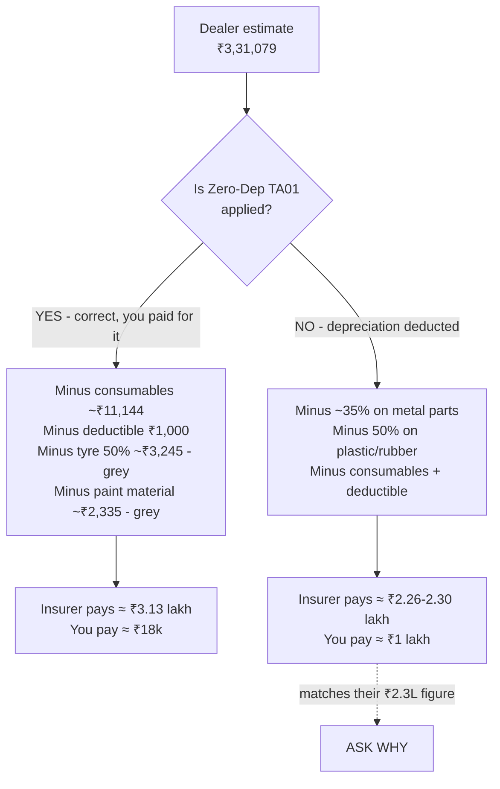
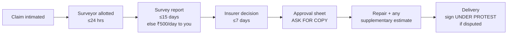
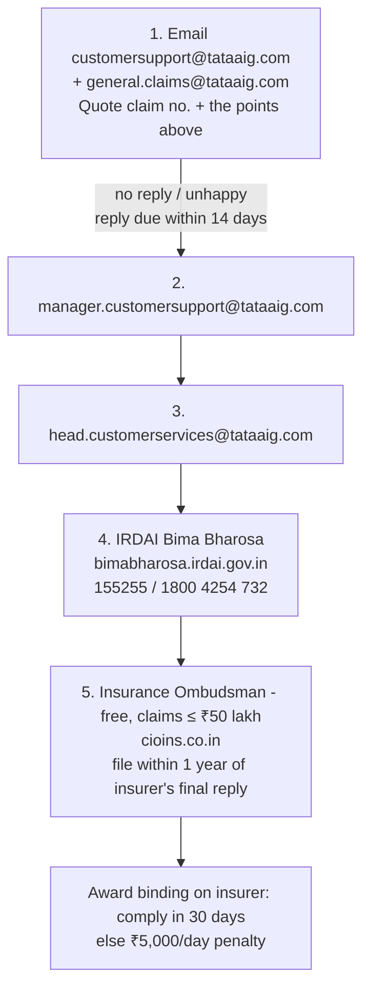
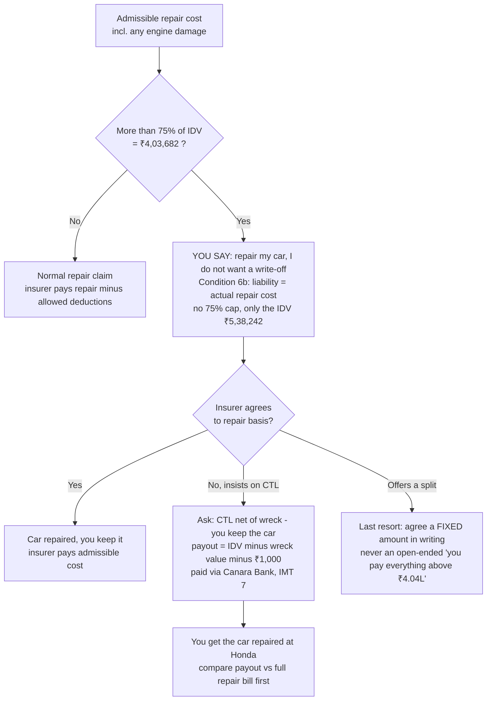
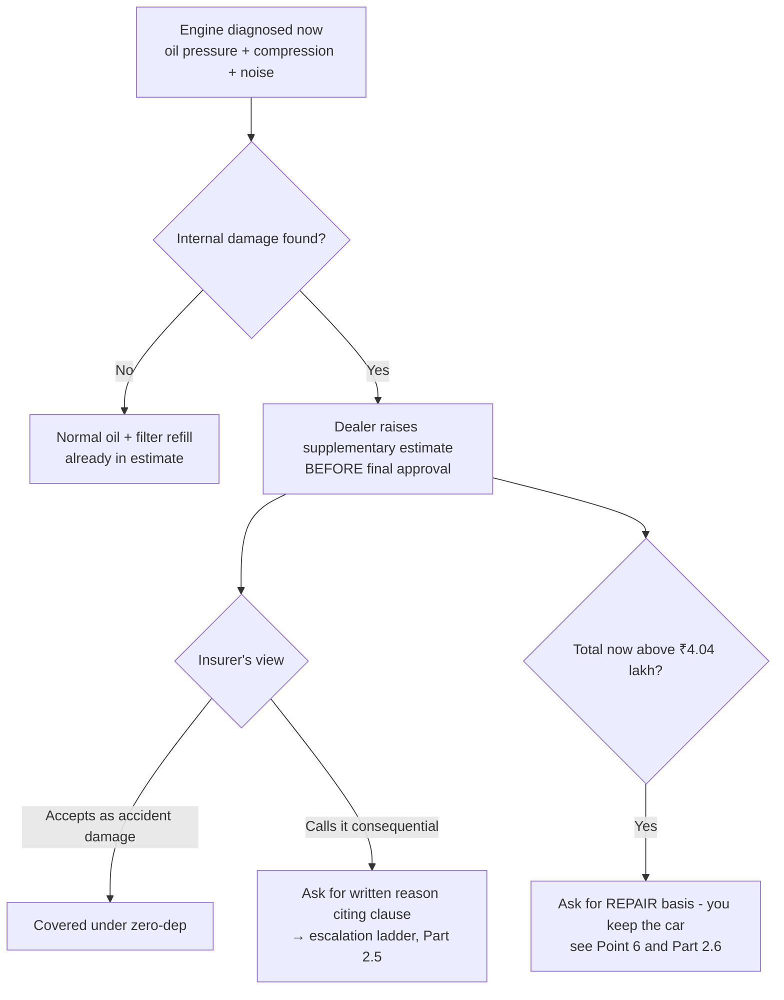

# Talking Points — Tata AIG claim, Honda Amaze MH27DE4665

Policy **6206007703 00 00** · Workshop RO **SER-RO-DD178-2627-2300** · Dealer estimate **₹3,31,079**

> Every rule quoted below comes from one of three sources:
> - **your exact policy wording**: Tata AIG Auto Secure, UIN IRDAN108RPMT0002V02200001, the same UIN that is printed on your policy;
> - **your policy schedule** (the PDF in this folder);
> - the **IRDAI Master Circular on Protection of Policyholders' Interests, 2024**.
>
> Clause references are given so you can point to them. Where something is a *grey area*, it is marked as one. Don't present a grey area as a certainty.

---

## PART 1 — WHAT TO SAY (read this before every call or visit)

### 🎯 Point 1. "₹3.31 lakh estimate vs ₹2.3 lakh offer: show me the line-by-line breakdown."
> "The dealer estimate is ₹3,31,079. You're saying about ₹2.3 lakh. That's a gap of about **₹1 lakh**. Under IRDAI's 2024 policyholder-protection rules, deductions must be **transparent, reasonable and supported by documentary justification**. Please send me the **surveyor's assessment sheet**. For **each line**, I need: the amount allowed, the depreciation deducted, any amount disallowed, and the reason."

The things you can legitimately lose under your policy add up to only **about ₹18,000**:

| Allowed deduction | ₹ (approx.) | Basis |
|---|---:|---|
| Compulsory deductible | 1,000 | Schedule, IMT 22 |
| Consumables (no TA18 add-on) | 11,144 | See the table in Part 3 |
| Tyre: 50% limit (grey area, see Point 3) | 3,245 | Section I, Exclusion 2(b) |
| Paint material depreciation, 12.5% of paint labour (grey area) | 2,335 | Section I, depreciation rule 5 |
| **Total** | **≈ 17,700** | |

So with zero-dep honoured, the payable amount should be **about ₹3.1 lakh**, not ₹2.3 lakh. **The remaining ~₹83,000 needs a written explanation.**

### 🎯 Point 2. "Is my Zero-Dep (TA01) cover being applied?" ← most likely cause of the gap
> "My policy has **TA01 Depreciation Reimbursement**. I paid ₹4,036.82 for it, and it covers 2 claims a year. This is my first claim. Is the ₹2.3 lakh **before or after** adding back the depreciation under TA01? Please confirm **in writing** that TA01 is applied to this claim."

**Why I suspect this:** I took the dealer's line items and deducted standard depreciation *as if you had no zero-dep*:
- 35% on metal parts, because the car is 4 years 1 month old;
- 50% on plastic and rubber parts;
- 12.5% on paint;
- plus consumables and the deductible.

The result is **≈ ₹2.26–2.30 lakh**, which is almost exactly their ₹2.3 lakh figure. (This is my approximation. The exact number depends on how each part is classified.)

TA01 only has **two conditions** (your policy wording, TA01 "Special Conditions"):
1. The claim must involve replacement of parts. ✅ It does: 66 parts are being replaced.
2. The car must be repaired at a Tata AIG **authorised garage / workshop / service station**. ❓ Make them confirm that Girnar Autoventures counts as one.

> "Please confirm that Girnar Autoventures is your authorised workshop for this claim. If it is, TA01 must apply. If it isn't, tell me now, in writing, before repairs start."

### 🎯 Point 3. "Tyres get no reimbursement" → this is NOT what the policy says
> "Section I, Exclusion 2(b) of my policy says tyres are not covered **unless the vehicle is damaged at the same time, in which case liability is limited to 50% of the cost of replacement**. My car was badly damaged in the same accident, so **at least 50% of the tyre is payable**. Also, the depreciation table in Section I lists *'All rubber/nylon/plastic parts, **tyres**, tubes and batteries — 50%'* as a **depreciation** rate. TA01 reimburses depreciation deducted on parts replaced, and TA01 has **no tyre exclusion**. So I'm asking for the full tyre amount."

- **Certain:** at least **50% of ₹6,490 = ₹3,245** is payable. "Zero for tyres" is wrong.
- **Arguable:** the other 50% under TA01. The insurer may say 2(b) is a *liability limit*, not "depreciation". This is a grey area, so push for it, but don't expect a guarantee.
- **Don't let them mix up the wheel and the tyre.** The **alloy wheel (₹10,929)** is a metal part, fully covered under zero-dep. Only the **tyre (₹6,490)** is affected by the 50% rule.
- The "claim within 3 working days" rule belongs to the **Tyre Secure** add-on. You did **not** buy that, so it **doesn't apply** to you.

### 🎯 Point 4. "Consumables aren't covered": partly true. Make them show which items they mean
> "I accept I don't have the TA18 consumables add-on. But TA18 defines consumables as engine oil, gearbox oil, lubricants, nuts and bolts, screws, distilled water, grease, oil filter, bearings, washers, clips, brake oil and AC gas, and items of similar nature. Please list **exactly which lines** you treat as consumables. The total of those lines should be about **₹11,100**, not more. **Parts** such as the windscreen rubber dam, seals, the alternator belt, spacers and the tyre are **not consumables**."

Optional, low chance of success: "The engine oil and coolant were lost **because** the crash broke the oil pan and radiator, so they are accident loss." The base policy wording has no line that excludes consumables. However, insurers point to the existence of the TA18 add-on, so expect a no.

### 🎯 Point 5. Engine (oil leaked, engine was started once and sounded bad): get it checked NOW, before final approval
> "After the crash all the engine oil leaked out because the oil pan was hit. The oil pan is already in the estimate as accident damage. The engine was started once afterwards and sounded abnormal, and it has **not** been started since. I want the engine **diagnosed before the repair is approved**: oil pressure, compression, and noise/bearing check. Please note it on the job card, and raise a **supplementary estimate** if there's internal damage."

- **Be truthful about the start.** Your policy (General Conditions → Cancellation) lets the insurer cancel the policy *ab initio* for **established fraud**. Hiding or changing facts risks the **whole claim**, not just the engine.
- See Part 4 for the risk and the arguments on both sides.

### 🎯 Point 6. If repairs cross ₹4.04 lakh: "I want my car REPAIRED, not written off"
**Your goal is to keep the car.** Say it clearly. Just don't offer to pay everything above ₹4.04 lakh, because the policy doesn't require that.

> "Even if the repair cost goes above 75% of IDV, I want the car **repaired and returned to me**. I do **not** want it treated as a total loss. Please settle this on a **repair basis**. Under my policy, your liability for a repair is the **actual and reasonable cost of repair** (Condition 6(b)), and the overall maximum is the IDV of ₹5,38,242. The 75% figure is the point at which you *may* treat the car as a total loss. It is **not** a cap on repair payments."

**Facts behind this (your V02 policy wording):**
- **Definitions §3:** the car "will be considered" a Constructive Total Loss when repair cost exceeds 75% of the Sum Insured (₹4,03,682). This is the **trigger** for total-loss treatment.
- **Condition 6:** "The Company may **at its own option** repair, reinstate or replace the vehicle … or may pay in cash." So the insurer has the final choice. You can't *force* a repair, but you can ask for one and negotiate.
- **Condition 6(b):** for a repair (partial loss), the insurer is liable for "actual and reasonable costs of repair and/or replacement … subject to depreciation". With zero-dep, there's effectively no depreciation. **No 75% cap is written here.** The only ceiling is the IDV.

**Fallback if Tata AIG insists on total loss:** ask for settlement **"net of wreck"**, so that **you keep the car**.
- **Condition 6(a):** total-loss payout = **IDV minus the value of the wreck**. If you keep the wreck, its value is subtracted from the ₹5,38,242, and you then get the car repaired yourself at Honda.
- Because of IMT 7, this payout goes to **Canara Bank first**, and the bank has to agree.
- Weigh both options with real numbers before choosing: the payout (IDV − wreck value − ₹1,000) against Honda's full repair bill.

**Order of preference:**
1. Repair basis, insurer pays the full admissible cost.
2. If the insurer refuses: total loss "net of wreck", you keep the car and repair it.
3. Only as a last resort, a negotiated split where you contribute something. If you do agree to pay extra, get the exact amount in writing first. Never agree to an open-ended "everything above ₹4.04 lakh".

### 🎯 Point 7. Ask for these in writing (email is best)
1. The **surveyor's name, licence number and appointment date**. IRDAI requires the insurer to tell you the surveyor's details, role and responsibilities *immediately* after appointing them.
2. The **assessment / approval sheet**, line by line.
3. **Written confirmation** that TA01 zero-dep applies, and that Girnar is an authorised workshop.
4. **Written reasons** for every deduction or disallowed item.
5. Whether **GST** is included in the ₹2.3 lakh. Your policy shows GSTIN "NA", so GST is a real cost to you.

### 🎯 Point 8. Timelines they must meet (IRDAI Master Circular 2024)
- Surveyor allotted within **24 hours** of claim intimation.
- Survey report within **15 days** of allotment. After that, **₹500 per day** of delay is payable to *you*.
- Insurer's decision within **7 days** of the report (or 15 days from allotment, whichever is earlier).
- If the claim isn't settled on time, **interest at bank rate + 2%** is payable to you, without you asking.
- No claim can be rejected **for want of documents or for delayed intimation**.

### 🎯 Point 9. At delivery: don't sign away your rights
If you have to pay your share and sign the satisfaction/discharge note to get the car back while a deduction is still in dispute, write on it:
**"Accepted under protest. Dispute regarding deductions of ₹____ pending."** Then sign it, date it, and keep a photo.
- Supreme Court, *National Insurance v. Boghara Polyfab* (2009): a discharge voucher does **not** end the dispute if it was signed under coercion or economic duress.
- Delhi High Court (2026): a voucher signed **without protest** **does** bar further claims.

### 🎯 Point 10. Other money you're owed
- **TA10:** taxi/hotel on the accident day, up to **₹5,000** (keep the receipts).
- **TA09:** personal belongings damaged in the car, up to **₹10,000** (minus ₹250).
- **Towing:** up to **₹1,500** under the base policy, *or* free within 25 km under RSA (TA19).
- **Salvage:** the insurer **cannot deduct salvage value** on a partial loss. It must collect the old parts itself (policy Condition 6(c), and the IRDAI Master Circular).

---

## PART 2 — UNDERSTANDING IT (simple version)

### 2.1 Where should the money go? Two scenarios

**In one line:** zero-dep means the insurer does *not* cut money for the car being 4 years old. Without it, they take 35–50% off every new part. You paid for zero-dep, so ask why the number looks like you didn't.

### 2.2 Depreciation, explained
New parts are "better than" the old parts they replace. So a normal policy says: *"we'll pay only part of the new part's price."*
Your car's rates (your policy, Section I):

| Part type | Normal deduction | With TA01 zero-dep |
|---|---|---|
| Metal parts (bulkhead, subframe, drive shafts, compressor, airbag units…), car 4–5 yrs old | **35%** | **0%**, paid back |
| Rubber / plastic / nylon (bumper, grilles, lamps, liners…) | **50%** | **0%**, paid back |
| Glass (windscreen) | **0%** | 0% |
| Tyres | 50% (also a liability limit, Excl. 2(b)) | **at least 50% paid**; the rest is a grey area |
| Paint | 12.5% of paint bill (50% on the 25% "material" part) | grey area |
| Non-OEM / non-OES parts used in repair | **no depreciation at all** (rule 6, and IRDAI) | — |

### 2.3 What the insurer CAN legitimately cut (if they explain it)
A surveyor *may* reduce the bill for these reasons, but each one must be **stated and justified**:
- **Not caused by this accident.** Example: left-side suspension parts, if they look worn rather than crash-damaged.
- **Repair instead of replace.** Example: a headlamp with only its mounting tabs broken.
- **Labour above their agreed rates**, or **duplicate labour.** The estimate has two bulkhead-replacement lines (₹5,664 + ₹5,101) and two vague lump sums (₹7,670 + ₹5,310).
- **Wrong item.** The estimate has engine-mount labour marked "(DIESEL)" on a petrol car (₹850).

👉 If they've cut for these reasons, fine, but **you're entitled to see it line by line**. Many of these cuts are the dealer's problem, not yours: ask the dealer to remove items the insurer rejects, instead of billing you for them.

### 2.4 How the claim moves, and where you can push

### 2.5 If they don't fix it: escalation ladder

### 2.6 If repairs cross 75% of IDV: keeping your car

**In one line:** ₹4.04 lakh is the line where the insurer is *allowed* to call it a total loss. It is not the most they'll pay. You can still ask for a repair and keep your car.

---

## PART 3 — CONSUMABLES TABLE (from your estimate)

Tata AIG's own definition (TA18 wording): *engine oil, gear box oil, lubricants, nut & bolt, screw, distilled water, grease, oil filter, bearing, washers, clip, brake oil, air conditioner gas and items of similar nature, excluding fuel.*

### 3a. Items that ARE consumables. You will probably pay these.

| # | Estimate item | Qty | ₹ incl. GST | Why it's a consumable | Comment |
|---|---|---|---:|---|---|
| 1 | Engine oil, synthetic petrol (100 ml units) | 42 = **4.2 L** | 2,521.12 | "engine oil" (named) | ⚠️ Amaze 1.2 needs ~**3.5 L** → ask why 4.2 L |
| 2 | Oil filter cartridge | 1 | 206.00 | "oil filter" (named) | Normal |
| 3 | Radiator liquid (coolant) 1 L | 4 | 1,253.63 | fluid, "items of similar nature" | Normal for a new radiator |
| 4 | R-134a AC gas | 4 | 1,038.40 | "air conditioner gas" (named) | Normal for a new compressor/condenser |
| 5 | Glass sealant | 2 | 2,497.99 | "items of similar nature" | For the windscreen. Ask why 2 units |
| 6 | Clip, bumper | 10 | 1,290.09 | "clip" (named) | |
| 7 | Clip, inner fender | 20 | 1,802.80 | "clip" (named) | Ask why 20 |
| 8 | Clip, front windscreen upper | 2 | 157.20 | "clip" (named) | |
| 9 | Push nut 3 mm | 2 | 118.26 | "nut" (named) | |
| 10 | Bolt, flange 8×102 | 4 | 258.37 | "nut & bolt" (named) | |
| | **TOTAL CONSUMABLES** | | **11,143.86** | | This is the **maximum** consumables deduction. Anything above this is not "consumables". |

### 3b. Items that are NOT consumables. Push back if they're cut as "consumables".

| Estimate item | ₹ incl. GST | What it actually is | Covered how |
|---|---:|---|---|
| Tyre, Yokohama 175/65R15 | 6,490.00 | Tyre: its own rule (Excl. 2(b)) | **≥ 50% payable** (Point 3) |
| Alloy wheel 15×5.5J | 10,928.79 | Metal part | Fully covered with zero-dep |
| Belt, ACG (alternator belt) | 1,505.68 | Rubber **part** | Covered; 50% depreciation is reimbursed by TA01 |
| Rubber, windscreen dam A | 119.22 | Rubber part | Same as above |
| Seal, front instrument | 105.68 | Rubber part | Same as above |
| Dam std 5×5 | 308.53 | Rubber/foam part | Same as above |
| Spacers, front bumper side (×2) | 207.12 | Plastic parts | Same as above |
| Emblem H-mark, mouldings, garnishes | — | Plastic parts | Same as above |
| Oil pan, radiator, torque rod, bracket | — | Metal parts | Fully covered with zero-dep |

### 3c. Things a crash like yours usually needs, and whether they're in the estimate
| Normally needed after this type of crash | In estimate? |
|---|---|
| Engine oil + filter (oil pan was broken) | ✅ |
| Coolant (radiator replaced) | ✅ |
| AC gas (AC system opened) | ✅ |
| Windscreen sealant + clips (screen replaced) | ✅ |
| Bumper / inner-fender clips, nuts, bolts | ✅ |
| **Wheel alignment** (suspension + steering replaced) | ❌ Missing. It's labour, not a consumable. Ask for it to be added |
| Brake fluid (only needed if brake lines were opened) | ❌ Not listed. That's fine if the brakes weren't touched |
| Gearbox oil (only needed if gearbox oil was lost when the drive shafts were removed) | ❌ Not listed. Ask the dealer whether it's needed |

---

## PART 4 — THE ENGINE OIL SITUATION (know this clearly)

**Facts:**
1. The crash damaged the oil pan, and all the engine oil leaked out. The oil pan is already listed as accident damage (₹8,382 part + ₹1,699 labour).
2. The engine was **started once** after that. It ran but **sounded bad**.
3. It has **not** been started since, and should not be.

**What your policy says (exact clauses):**
- **Section I, Exclusion 2(a):** no payment for *"consequential loss, … mechanical or electrical breakdown, failures or breakages."*
- **General Condition 3 (Right to Inspect):** *"if the vehicle insured be **driven** before the necessary repairs are effected, any extension of the damage or any further damage to the vehicle shall be entirely at the insured's own risk."*
- **General Condition 2:** you must take *"all reasonable steps to safeguard the vehicle."*
- You do **not** have **Engine Secure**. That add-on exists specifically for oil-leak and water-ingress engine damage.

**Honest risk assessment:** if the engine has internal damage (bearings, crankshaft, piston rings), Tata AIG is **likely to argue** that it was caused by starting the engine without oil, not by the crash. That would make it "consequential" damage, at your own risk.

**Your arguments (reasonable, but not guaranteed):**
- The oil loss itself was **caused by the accident**, and the insurer has accepted that by including the oil pan.
- The car was **started, not driven**. Condition 3 says "driven". (The insurer may still invoke "reasonable care" under Condition 2.)
- **IRDAI Master Circular:** an insurer *cannot reject a claim in full or part where a breached condition is "not relevant to the nature or circumstances of loss."* To be fair, the insurer will say a no-oil start *is* relevant to engine damage. Use this point carefully.

**Do:** get it diagnosed and documented before approval. Keep the original photos of the oil leak/pan damage, if you have any. Tell the truth if asked.
**Don't:** start the engine again. Don't say "it was never started", because that would put the whole claim at risk.

---

## PART 5 — RULES IN YOUR FAVOUR (quick reference)

| Rule | Where it's written | Use it for |
|---|---|---|
| Zero-dep pays back depreciation on replaced parts, 2 claims per year | TA01 wording + schedule ("No. of claims: 2") | The ₹2.3L vs ₹3.1L gap |
| Tyres: 50% payable when the vehicle is damaged at the same time | Section I, Excl. 2(b) | "No tyre reimbursement" is wrong |
| Glass gets no depreciation | Section I, depreciation rule 3 | Windscreen paid in full |
| No depreciation on non-OEM/OES parts | Section I, rule 6; IRDAI MC 2024 | If cheaper parts are used |
| No deduction for salvage on partial loss; insurer collects it | Condition 6(c); IRDAI MC 2024 | If they cut "salvage value" |
| Towing up to ₹1,500 per accident | Section I, clause 3 | The ₹1,500.96 towing line |
| 75% of IDV (₹4,03,682) is only the total-loss *trigger*. Repair liability = actual reasonable cost, up to IDV | Definitions §3; Condition 6(b) | Keeping the car if the bill goes past ₹4.04L |
| If the insurer insists on total loss: payout = IDV − wreck value, so you can keep the wreck | Condition 6(a) | Fallback to still keep the car |
| Deductions must be transparent, reasonable and documented | IRDAI PPHI Regs 2024 / MC 2024 | Ask for the line-by-line sheet |
| Surveyor details must be given to you immediately | IRDAI MC 2024 | Ask who the surveyor is |
| Report ≤15 days (₹500/day penalty); decision ≤7 days; interest bank rate +2% on delay | IRDAI MC 2024 | If they delay |
| No rejection for want of documents or delayed intimation | IRDAI MC 2024 | If they cite paperwork |
| Can't reject for a breached condition that's irrelevant to the loss (e.g. PUC) | IRDAI MC 2024 | PUC "NA" on the policy |
| Complaint reply within 14 days, with reasons citing the policy terms | IRDAI MC 2024 | Escalation |
| Ombudsman: free, claims up to ₹50 lakh, award binding (₹5,000/day penalty if not paid within 30 days) | IRDAI MC 2024 | Last resort before court |
| Compulsory deductible is only ₹1,000 (voluntary deductible ₹0, imposed excess ₹0) | Schedule | A big "customer share" can't be explained by the deductible |

---

## PART 6 — CHECKLIST

- [ ] Claim number noted: `__________`. Surveyor name and licence: `__________`
- [ ] Email sent asking for: the line-by-line assessment, written TA01 confirmation, confirmation that Girnar is an authorised workshop, whether GST is included
- [ ] Tyre: insisted on ≥50%, and asked for 100% under TA01
- [ ] Consumables list matched against Part 3a (≤ ₹11,144)
- [ ] Engine diagnosed; supplementary estimate raised if needed. If the total is above ₹4.04L, asked in writing for a **repair basis** (keep the car), with "net of wreck" as the fallback
- [ ] Dealer asked about the flagged lines: DIESEL mount, double bulkhead labour, lump sums, left suspension, AC clutch, driver airbag, missing bonnet and alignment (see `init-flag.md`)
- [ ] TA10 taxi/hotel receipts and TA09 belongings claim submitted
- [ ] NCB / previous-policy question (init-flag F-1) clarified
- [ ] At delivery: wrote "under protest" if anything is still disputed; took photos of the signed note

---

### Sources (all checked on 7 Oct 2026)
- **Your policy schedule:** the PDF in this folder (TA01 with 2 claims, deductible ₹1,000, IDV ₹5,38,242, IMT 7 Canara Bank, Engine Secure "NA", TA18 not opted).
- **Tata AIG Auto Secure Base Policy Wording, UIN IRDAN108RPMT0002V02200001 (your exact version):** [tataaig.com PDF](https://www.tataaig.com/s3/Auto_Secure_Private_Car_Package_Base_Policy_Wording_31ed1ddc55.pdf). Used for Section I depreciation, Excl. 2(a)/2(b), towing ₹1,500, Conditions 2, 3 and 6, and the CTL definition.
- **Tata AIG full policy wordings with add-ons (TA01, TA18):** [tataaig.com PDF](https://www.tataaig.com/s3/Policy_Wordings_auto_secure_private_car_package_policy.pdf_703fae35ff.pdf)
- **Tata AIG Customer Information Sheet** (claim process, escalation emails, 7-day payment): [tataaig.com PDF](https://www.tataaig.com/s3/auto_secure_private_car_package_policy_cis_5af461c4e5.pdf)
- **IRDAI Master Circular on Protection of Policyholders' Interests, 2024** (surveyor timelines, ₹500/day, interest, salvage, non-OEM, grievance 14 days, Ombudsman ₹50 lakh, ₹5,000/day): [PDF copy](https://www.caalley.com/irdai_mc/MC_Protection_of_Policyholders_interests_2024.pdf)
- **Deductions must be "reasonable, transparent and supported by documentary justification"** (IRDAI PPHI Regs 2024): [Angel One summary, Dec 2025](https://www.angelone.in/news/personal-finance/irdai-strengthens-safeguards-for-motor-insurance-policyholders-interests-what-you-need-to-know)
- **Discharge vouchers:** [Boghara Polyfab (SC 2009) summary](https://www.caseon.in/case/national-insurance-co-ltd-vs-ms-boghara-polyfab-pvt-ltd) · [Delhi HC, Mar 2026: discharge voucher bars further claims (SCC Online)](https://www.scconline.com/blog/post/2026/03/22/del-hc-execution-of-discharge-voucher-acknowledging-settlement-bars-further-claims/) · [RawLaw: signing without protest bars claims](https://rawlaw.in/delhi-high-court-signing-discharge-voucher-without-protest-bars-further-insurance-claims-insurer-succeeds-in-appeal/)
- **Bima Bharosa / Ombudsman contact details:** [bimabharosa.irdai.gov.in](https://bimabharosa.irdai.gov.in/) · [cioins.co.in](https://cioins.co.in/Complaint/Online)
- **Amaze 1.2 oil capacity ~3.5 L:** [91wheels specs](https://www.91wheels.com/car/honda/amaze/specifications)
- **The ₹2.26–2.30 lakh "no zero-dep" figure** is my own calculation from `docs/estimate-line-items.csv`, using the policy's depreciation rates. It is an approximation, not the insurer's number.
